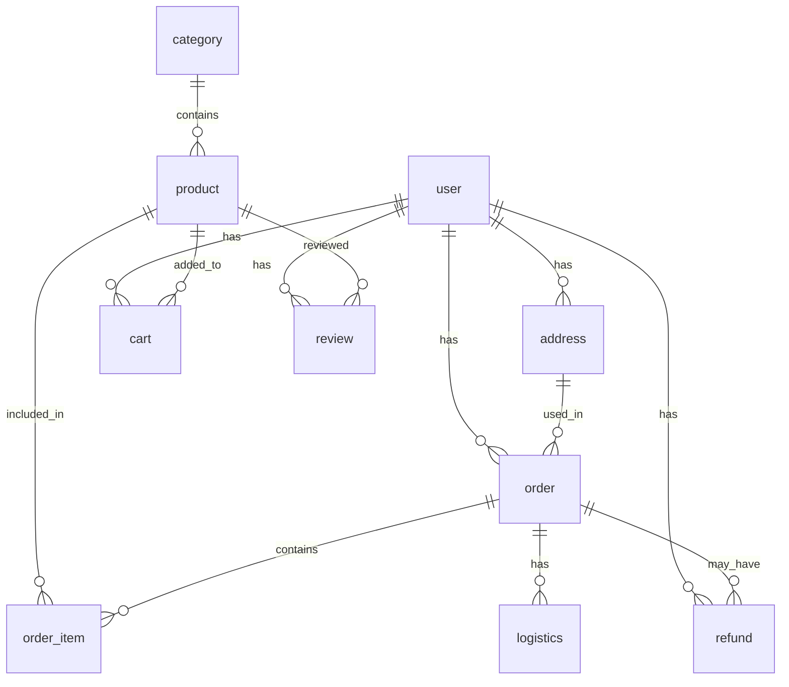

# 茶叶电商平台开发文档

## 1. 项目概述

茶叶电商平台是一个专注于茶叶销售的电子商务系统，为用户提供茶叶浏览、购买、支付、物流查询等全流程服务，同时为管理员提供商品管理、订单管理、用户管理等后台管理功能。

### 1.1 项目特点

- 前后端分离架构，前端使用Vue 3 + Element Plus，后端使用Spring Boot + MyBatis
- 完整的电商功能模块，包括用户管理、商品管理、购物车、订单管理、物流管理等
- 响应式设计，适配不同设备
- 安全的用户认证和授权机制
- 丰富的商品信息和分类管理
- 完善的订单处理流程

## 2. 技术栈

### 2.1 前端技术栈

| 技术/框架 | 版本 | 用途 |
|---------|------|------|
| Vue.js | 3.4.0 | 前端框架 |
| Vue Router | 4.2.5 | 路由管理 |
| Pinia | 2.1.7 | 状态管理 |
| Axios | 1.6.2 | HTTP请求 |
| Element Plus | 2.4.4 | UI组件库 |
| Vite | 5.0.8 | 构建工具 |

### 2.2 后端技术栈

| 技术/框架 | 版本 | 用途 |
|---------|------|------|
| Spring Boot | 3.5.8 | 后端框架 |
| MyBatis | 3.0.5 | ORM框架 |
| MySQL | 8.0+ | 数据库 |
| Redis | - | 缓存 |
| JWT | 0.12.3 | 认证授权 |
| Java | 17 | 开发语言 |
| Maven | - | 依赖管理 |

## 3. 项目结构

### 3.1 前端项目结构

```
frontend/
├── public/                # 静态资源
│   ├── banner/            # 轮播图
│   └── logo/              # 网站Logo
├── src/
│   ├── layouts/           # 布局组件
│   │   ├── AdminLayout.vue  # 后台布局
│   │   └── MainLayout.vue    # 前台布局
│   ├── router/            # 路由配置
│   │   └── index.js       # 路由定义
│   ├── stores/            # 状态管理
│   │   └── user.js        # 用户状态
│   ├── utils/             # 工具函数
│   │   └── api.js         # API请求封装
│   ├── views/             # 页面组件
│   │   ├── admin/         # 后台页面
│   │   ├── Home.vue       # 首页
│   │   ├── Products.vue   # 商品列表
│   │   ├── ProductDetail.vue  # 商品详情
│   │   ├── Cart.vue       # 购物车
│   │   ├── Orders.vue     # 订单列表
│   │   ├── OrderDetail.vue  # 订单详情
│   │   ├── Addresses.vue  # 地址管理
│   │   ├── Profile.vue    # 个人中心
│   │   ├── Login.vue      # 登录
│   │   └── Register.vue   # 注册
│   ├── App.vue            # 根组件
│   ├── main.js            # 入口文件
│   └── style.css          # 全局样式
├── index.html             # HTML模板
├── package.json           # 依赖配置
└── vite.config.js         # Vite配置
```

### 3.2 后端项目结构

```
src/main/java/com/reservation/teaecommerceplatform/
├── common/                # 公共类
│   └── Result.java        # 响应结果封装
├── config/                # 配置类
│   ├── CorsConfig.java    # 跨域配置
│   ├── RedisConfig.java   # Redis配置
│   └── WebConfig.java     # Web配置
├── controller/            # 控制器
│   ├── AddressController.java  # 地址管理
│   ├── AdminController.java    # 后台管理
│   ├── CartController.java     # 购物车管理
│   ├── CategoryController.java # 分类管理
│   ├── FileUploadController.java # 文件上传
│   ├── LogisticsController.java # 物流管理
│   ├── OrderController.java    # 订单管理
│   ├── ProductController.java  # 商品管理
│   ├── RefundController.java   # 退款管理
│   ├── ReviewController.java   # 评论管理
│   └── UserController.java     # 用户管理
├── dto/                   # 数据传输对象
│   ├── ProductQueryDTO.java  # 商品查询
│   ├── UserLoginDTO.java     # 用户登录
│   └── UserRegisterDTO.java  # 用户注册
├── entity/                # 实体类
│   ├── Address.java       # 地址
│   ├── Cart.java          # 购物车
│   ├── Category.java      # 分类
│   ├── Logistics.java     # 物流
│   ├── Order.java         # 订单
│   ├── OrderItem.java     # 订单项
│   ├── Product.java       # 商品
│   ├── Refund.java        # 退款
│   ├── Review.java        # 评论
│   └── User.java          # 用户
├── interceptor/           # 拦截器
│   ├── AdminInterceptor.java  # 管理员权限
│   └── JwtInterceptor.java    # JWT认证
├── mapper/                # Mapper接口
│   ├── AddressMapper.java  # 地址映射
│   ├── CartMapper.java     # 购物车映射
│   ├── CategoryMapper.java # 分类映射
│   ├── LogisticsMapper.java # 物流映射
│   ├── OrderItemMapper.java # 订单项映射
│   ├── OrderMapper.java    # 订单映射
│   ├── ProductMapper.java  # 商品映射
│   ├── RefundMapper.java   # 退款映射
│   ├── ReviewMapper.java   # 评论映射
│   └── UserMapper.java     # 用户映射
├── service/               # 服务层
│   ├── impl/              # 实现类
│   ├── AddressService.java # 地址服务
│   ├── CartService.java    # 购物车服务
│   ├── CategoryService.java # 分类服务
│   ├── LogisticsService.java # 物流服务
│   ├── OrderService.java   # 订单服务
│   ├── ProductService.java # 商品服务
│   ├── RefundService.java  # 退款服务
│   ├── ReviewService.java  # 评论服务
│   ├── StatisticsService.java # 统计服务
│   └── UserService.java    # 用户服务
├── util/                  # 工具类
│   ├── JwtUtil.java       # JWT工具
│   └── Md5Util.java       # MD5加密
└── TeaEcommercePlatformApplication.java # 应用入口
```

## 4. 数据库设计

### 4.1 数据库表结构

#### 4.1.1 用户表 (user)
| 字段名 | 数据类型 | 约束 | 描述 |
|-------|---------|------|------|
| id | bigint | NOT NULL AUTO_INCREMENT | 用户ID |
| username | varchar(50) | NOT NULL | 用户名 |
| password | varchar(255) | NOT NULL | 密码 |
| email | varchar(100) | NULL | 邮箱 |
| phone | varchar(20) | NULL | 手机号 |
| nickname | varchar(50) | NULL | 昵称 |
| avatar | varchar(255) | NULL | 头像 |
| gender | tinyint | NULL DEFAULT 0 | 性别：0-未知 1-男 2-女 |
| status | tinyint | NULL DEFAULT 1 | 状态：0-禁用 1-启用 |
| role | tinyint | NULL DEFAULT 0 | 角色：0-普通用户 1-管理员 |
| create_time | datetime | NULL DEFAULT CURRENT_TIMESTAMP | 创建时间 |
| update_time | datetime | NULL DEFAULT CURRENT_TIMESTAMP ON UPDATE CURRENT_TIMESTAMP | 更新时间 |

#### 4.1.2 商品分类表 (category)
| 字段名 | 数据类型 | 约束 | 描述 |
|-------|---------|------|------|
| id | bigint | NOT NULL AUTO_INCREMENT | 分类ID |
| name | varchar(100) | NOT NULL | 分类名称 |
| description | varchar(500) | NULL | 分类描述 |
| image | varchar(255) | NULL | 分类图片 |
| parent_id | bigint | NULL DEFAULT 0 | 父分类ID，0表示顶级分类 |
| sort_order | int | NULL DEFAULT 0 | 排序 |
| status | tinyint | NULL DEFAULT 1 | 状态：0-禁用 1-启用 |
| create_time | datetime | NULL DEFAULT CURRENT_TIMESTAMP | 创建时间 |
| update_time | datetime | NULL DEFAULT CURRENT_TIMESTAMP ON UPDATE CURRENT_TIMESTAMP | 更新时间 |

#### 4.1.3 商品表 (product)
| 字段名 | 数据类型 | 约束 | 描述 |
|-------|---------|------|------|
| id | bigint | NOT NULL AUTO_INCREMENT | 商品ID |
| name | varchar(200) | NOT NULL | 商品名称 |
| description | varchar(500) | NULL | 商品描述 |
| detail | text | NULL | 商品详情 |
| price | decimal(10,2) | NOT NULL | 价格 |
| original_price | decimal(10,2) | NULL | 原价 |
| stock | int | NULL DEFAULT 0 | 库存 |
| images | text | NULL | 商品图片，JSON格式存储 |
| category_id | bigint | NULL | 分类ID |
| origin | varchar(100) | NULL | 产地 |
| process | varchar(100) | NULL | 工艺 |
| grade | varchar(50) | NULL | 等级 |
| sales | int | NULL DEFAULT 0 | 销量 |
| status | tinyint | NULL DEFAULT 1 | 状态：0-下架 1-上架 |
| create_time | datetime | NULL DEFAULT CURRENT_TIMESTAMP | 创建时间 |
| update_time | datetime | NULL DEFAULT CURRENT_TIMESTAMP ON UPDATE CURRENT_TIMESTAMP | 更新时间 |

#### 4.1.4 地址表 (address)
| 字段名 | 数据类型 | 约束 | 描述 |
|-------|---------|------|------|
| id | bigint | NOT NULL AUTO_INCREMENT | 地址ID |
| user_id | bigint | NOT NULL | 用户ID |
| receiver_name | varchar(50) | NOT NULL | 收货人姓名 |
| receiver_phone | varchar(20) | NOT NULL | 收货人电话 |
| province | varchar(50) | NULL | 省份 |
| city | varchar(50) | NULL | 城市 |
| district | varchar(50) | NULL | 区县 |
| detail_address | varchar(200) | NOT NULL | 详细地址 |
| postal_code | varchar(10) | NULL | 邮编 |
| is_default | tinyint | NULL DEFAULT 0 | 是否默认：0-否 1-是 |
| create_time | datetime | NULL DEFAULT CURRENT_TIMESTAMP | 创建时间 |
| update_time | datetime | NULL DEFAULT CURRENT_TIMESTAMP ON UPDATE CURRENT_TIMESTAMP | 更新时间 |

#### 4.1.5 购物车表 (cart)
| 字段名 | 数据类型 | 约束 | 描述 |
|-------|---------|------|------|
| id | bigint | NOT NULL AUTO_INCREMENT | 购物车ID |
| user_id | bigint | NOT NULL | 用户ID |
| product_id | bigint | NOT NULL | 商品ID |
| quantity | int | NULL DEFAULT 1 | 商品数量 |
| create_time | datetime | NULL DEFAULT CURRENT_TIMESTAMP | 创建时间 |
| update_time | datetime | NULL DEFAULT CURRENT_TIMESTAMP ON UPDATE CURRENT_TIMESTAMP | 更新时间 |

#### 4.1.6 订单表 (order)
| 字段名 | 数据类型 | 约束 | 描述 |
|-------|---------|------|------|
| id | bigint | NOT NULL AUTO_INCREMENT | 订单ID |
| order_no | varchar(50) | NOT NULL | 订单号 |
| user_id | bigint | NOT NULL | 用户ID |
| address_id | bigint | NOT NULL | 收货地址ID |
| total_amount | decimal(10,2) | NOT NULL | 订单总金额 |
| discount_amount | decimal(10,2) | NULL DEFAULT 0.00 | 优惠金额 |
| pay_amount | decimal(10,2) | NOT NULL | 实付金额 |
| status | tinyint | NULL DEFAULT 0 | 订单状态：0-待支付 1-已支付 2-已发货 3-已完成 4-已取消 5-退款中 6-已退款 |
| pay_type | tinyint | NULL DEFAULT 0 | 支付方式：0-未支付 1-支付宝 2-微信 3-银行卡 |
| pay_time | varchar(50) | NULL | 支付时间 |
| logistics_no | varchar(50) | NULL | 物流单号 |
| remark | varchar(500) | NULL | 备注 |
| create_time | datetime | NULL DEFAULT CURRENT_TIMESTAMP | 创建时间 |
| update_time | datetime | NULL DEFAULT CURRENT_TIMESTAMP ON UPDATE CURRENT_TIMESTAMP | 更新时间 |

#### 4.1.7 订单项表 (order_item)
| 字段名 | 数据类型 | 约束 | 描述 |
|-------|---------|------|------|
| id | bigint | NOT NULL AUTO_INCREMENT | 订单项ID |
| order_id | bigint | NOT NULL | 订单ID |
| product_id | bigint | NOT NULL | 商品ID |
| product_name | varchar(200) | NOT NULL | 商品名称 |
| product_image | varchar(255) | NULL | 商品图片 |
| price | decimal(10,2) | NOT NULL | 单价 |
| quantity | int | NOT NULL | 数量 |
| subtotal | decimal(10,2) | NOT NULL | 小计 |
| create_time | datetime | NULL DEFAULT CURRENT_TIMESTAMP | 创建时间 |

#### 4.1.8 物流信息表 (logistics)
| 字段名 | 数据类型 | 约束 | 描述 |
|-------|---------|------|------|
| id | bigint | NOT NULL AUTO_INCREMENT | 物流ID |
| order_id | bigint | NOT NULL | 订单ID |
| logistics_no | varchar(50) | NULL | 物流单号 |
| company | varchar(100) | NULL | 物流公司 |
| status | varchar(50) | NULL | 物流状态 |
| detail | text | NULL | 物流详情，JSON格式 |
| create_time | datetime | NULL DEFAULT CURRENT_TIMESTAMP | 创建时间 |
| update_time | datetime | NULL DEFAULT CURRENT_TIMESTAMP ON UPDATE CURRENT_TIMESTAMP | 更新时间 |

#### 4.1.9 商品评论表 (review)
| 字段名 | 数据类型 | 约束 | 描述 |
|-------|---------|------|------|
| id | bigint | NOT NULL AUTO_INCREMENT | 评论ID |
| order_id | bigint | NOT NULL | 订单ID |
| order_item_id | bigint | NOT NULL | 订单项ID |
| user_id | bigint | NOT NULL | 用户ID |
| product_id | bigint | NOT NULL | 商品ID |
| product_name | varchar(200) | NULL | 商品名称 |
| product_image | varchar(255) | NULL | 商品图片 |
| rating | tinyint | NOT NULL | 评分：1-5星 |
| content | text | NULL | 评论内容 |
| images | text | NULL | 评论图片，JSON格式 |
| status | tinyint | NULL DEFAULT 0 | 状态：0-待审核 1-已通过 2-已拒绝 |
| reply | text | NULL | 商家回复 |
| reply_time | datetime | NULL | 回复时间 |
| create_time | datetime | NULL DEFAULT CURRENT_TIMESTAMP | 创建时间 |
| update_time | datetime | NULL DEFAULT CURRENT_TIMESTAMP ON UPDATE CURRENT_TIMESTAMP | 更新时间 |

#### 4.1.10 退款申请表 (refund)
| 字段名 | 数据类型 | 约束 | 描述 |
|-------|---------|------|------|
| id | bigint | NOT NULL AUTO_INCREMENT | 退款ID |
| order_id | bigint | NOT NULL | 订单ID |
| user_id | bigint | NOT NULL | 用户ID |
| order_no | varchar(50) | NOT NULL | 订单号 |
| refund_no | varchar(50) | NOT NULL | 退款单号 |
| refund_amount | decimal(10,2) | NOT NULL | 退款金额 |
| type | tinyint | NOT NULL | 退款类型：1-仅退款 2-退货退款 |
| reason | varchar(200) | NULL | 退款原因 |
| description | text | NULL | 退款说明 |
| images | text | NULL | 凭证图片，JSON格式 |
| status | tinyint | NULL DEFAULT 0 | 状态：0-待处理 1-已同意 2-已拒绝 3-退款中 4-已退款 5-已取消 |
| reject_reason | varchar(500) | NULL | 拒绝原因 |
| logistics_no | varchar(50) | NULL | 退货物流单号 |
| handler_id | bigint | NULL | 处理人ID |
| handle_time | varchar(50) | NULL | 处理时间 |
| create_time | datetime | NULL DEFAULT CURRENT_TIMESTAMP | 创建时间 |
| update_time | datetime | NULL DEFAULT CURRENT_TIMESTAMP ON UPDATE CURRENT_TIMESTAMP | 更新时间 |

### 4.2 数据库关系图



## 5. 核心功能模块

### 5.1 用户模块

#### 5.1.1 功能描述
- 用户注册：新用户可以通过手机号、邮箱注册账号
- 用户登录：用户可以使用用户名和密码登录系统
- 个人中心：用户可以查看和修改个人信息
- 地址管理：用户可以添加、修改、删除收货地址，设置默认地址

#### 5.1.2 关键流程
1. 用户注册流程
   - 输入注册信息（用户名、密码、手机号/邮箱）
   - 系统验证信息合法性
   - 密码加密存储
   - 生成用户账号

2. 用户登录流程
   - 输入登录信息（用户名、密码）
   - 系统验证用户名和密码
   - 生成JWT令牌
   - 返回用户信息和令牌

### 5.2 商品模块

#### 5.2.1 功能描述
- 商品列表：用户可以浏览商品列表，支持分类筛选
- 商品详情：用户可以查看商品的详细信息，包括图片、描述、价格等
- 商品搜索：用户可以通过关键词搜索商品
- 商品分类：用户可以按照商品分类浏览商品

#### 5.2.2 关键流程
1. 商品浏览流程
   - 用户进入商品列表页
   - 选择分类或输入搜索关键词
   - 系统查询商品数据
   - 展示商品列表

2. 商品详情查看流程
   - 用户点击商品进入详情页
   - 系统查询商品详细信息
   - 展示商品详情、图片、评价等

### 5.3 购物车模块

#### 5.3.1 功能描述
- 添加商品：用户可以将商品添加到购物车
- 修改数量：用户可以修改购物车中商品的数量
- 删除商品：用户可以从购物车中删除商品
- 结算：用户可以选择购物车中的商品进行结算

#### 5.3.2 关键流程
1. 添加商品到购物车流程
   - 用户在商品详情页点击"加入购物车"
   - 系统检查商品库存
   - 系统将商品添加到购物车（如果已存在则更新数量）

2. 购物车结算流程
   - 用户进入购物车页面
   - 选择要结算的商品
   - 点击"去结算"
   - 系统跳转到订单确认页面

### 5.4 订单模块

#### 5.4.1 功能描述
- 订单创建：用户可以从购物车创建订单
- 订单支付：用户可以支付订单
- 订单查询：用户可以查询自己的订单列表和详情
- 订单状态：系统跟踪订单状态（待支付、已支付、已发货、已完成、已取消、退款中、已退款）

#### 5.4.2 关键流程
1. 订单创建流程
   - 用户在购物车中选择商品并点击"去结算"
   - 用户选择收货地址和支付方式
   - 系统生成订单
   - 系统从购物车中移除已结算的商品

2. 订单支付流程
   - 用户在订单详情页点击"立即支付"
   - 系统跳转到支付页面
   - 用户完成支付
   - 系统更新订单状态为"已支付"

### 5.5 物流模块

#### 5.5.1 功能描述
- 物流信息：用户可以查看订单的物流信息
- 物流状态：系统跟踪物流状态（已发货、运输中、派送中、已签收）

#### 5.5.2 关键流程
1. 物流信息查询流程
   - 用户进入订单详情页
   - 点击"查看物流"
   - 系统查询物流信息
   - 展示物流详情

### 5.6 评论模块

#### 5.6.1 功能描述
- 商品评价：用户可以对已购买的商品进行评价
- 评价管理：管理员可以审核和回复用户评价

#### 5.6.2 关键流程
1. 商品评价流程
   - 用户在订单详情页点击"评价"
   - 用户输入评价内容和评分
   - 系统保存评价信息
   - 系统更新商品的评分

### 5.7 退款模块

#### 5.7.1 功能描述
- 退款申请：用户可以申请退款或退货退款
- 退款处理：管理员可以处理用户的退款申请

#### 5.7.2 关键流程
1. 退款申请流程
   - 用户在订单详情页点击"申请退款"
   - 用户选择退款类型和原因
   - 系统生成退款申请
   - 系统更新订单状态为"退款中"

2. 退款处理流程
   - 管理员在后台查看退款申请
   - 管理员审核退款申请
   - 管理员同意或拒绝退款
   - 系统更新退款状态和订单状态

### 5.8 后台管理模块

#### 5.8.1 功能描述
- 商品管理：管理员可以添加、修改、删除商品
- 分类管理：管理员可以添加、修改、删除商品分类
- 订单管理：管理员可以查看和处理订单
- 用户管理：管理员可以查看和管理用户
- 退款管理：管理员可以处理退款申请
- 统计分析：管理员可以查看系统的销售统计和用户统计

#### 5.8.2 关键功能
1. 商品管理
   - 商品列表：查看所有商品
   - 商品添加：添加新商品
   - 商品编辑：修改商品信息
   - 商品删除：删除商品

2. 订单管理
   - 订单列表：查看所有订单
   - 订单详情：查看订单详细信息
   - 订单处理：修改订单状态，发货等

3. 用户管理
   - 用户列表：查看所有用户
   - 用户详情：查看用户详细信息
   - 用户管理：禁用/启用用户，修改用户角色

## 6. API接口设计

### 6.1 用户接口

| API路径 | 方法 | 功能描述 | 请求体 (JSON) | 成功响应 (200 OK) |
|--------|------|---------|-------------|----------------|
| /api/user/register | POST | 用户注册 | `{"username": "...", "password": "...", "email": "...", "phone": "..."}` | `{"code": 200, "message": "注册成功", "data": null}` |
| /api/user/login | POST | 用户登录 | `{"username": "...", "password": "..."}` | `{"code": 200, "message": "登录成功", "data": {"token": "...", "user": {...}}}` |
| /api/user/info | GET | 获取用户信息 | N/A | `{"code": 200, "message": "获取成功", "data": {...}}` |
| /api/user/update | PUT | 更新用户信息 | `{"nickname": "...", "email": "...", "phone": "..."}` | `{"code": 200, "message": "更新成功", "data": null}` |
| /api/user/addresses | GET | 获取用户地址列表 | N/A | `{"code": 200, "message": "获取成功", "data": [...]}` |
| /api/user/address/add | POST | 添加地址 | `{"receiverName": "...", "receiverPhone": "...", "province": "...", "city": "...", "district": "...", "detailAddress": "..."}` | `{"code": 200, "message": "添加成功", "data": null}` |
| /api/user/address/update | PUT | 更新地址 | `{"id": 1, "receiverName": "...", "receiverPhone": "...", "province": "...", "city": "...", "district": "...", "detailAddress": "..."}` | `{"code": 200, "message": "更新成功", "data": null}` |
| /api/user/address/delete/{id} | DELETE | 删除地址 | N/A | `{"code": 200, "message": "删除成功", "data": null}` |
| /api/user/address/setDefault/{id} | PUT | 设置默认地址 | N/A | `{"code": 200, "message": "设置成功", "data": null}` |

### 6.2 商品接口

| API路径 | 方法 | 功能描述 | 请求体 (JSON) | 成功响应 (200 OK) |
|--------|------|---------|-------------|----------------|
| /api/product/list | GET | 获取商品列表 | N/A (Query参数: categoryId, keyword, page, size) | `{"code": 200, "message": "获取成功", "data": {...}}` |
| /api/product/detail/{id} | GET | 获取商品详情 | N/A | `{"code": 200, "message": "获取成功", "data": {...}}` |
| /api/product/add | POST | 添加商品 | `{"name": "...", "description": "...", "price": 100.00, "categoryId": 1, ...}` | `{"code": 200, "message": "添加成功", "data": null}` |
| /api/product/update | PUT | 更新商品 | `{"id": 1, "name": "...", "description": "...", "price": 100.00, ...}` | `{"code": 200, "message": "更新成功", "data": null}` |
| /api/product/delete/{id} | DELETE | 删除商品 | N/A | `{"code": 200, "message": "删除成功", "data": null}` |

### 6.3 购物车接口

| API路径 | 方法 | 功能描述 | 请求体 (JSON) | 成功响应 (200 OK) |
|--------|------|---------|-------------|----------------|
| /api/cart/list | GET | 获取购物车列表 | N/A | `{"code": 200, "message": "获取成功", "data": [...]}` |
| /api/cart/add | POST | 添加商品到购物车 | `{"productId": 1, "quantity": 1}` | `{"code": 200, "message": "添加成功", "data": null}` |
| /api/cart/update | PUT | 更新购物车商品数量 | `{"id": 1, "quantity": 2}` | `{"code": 200, "message": "更新成功", "data": null}` |
| /api/cart/delete/{id} | DELETE | 删除购物车商品 | N/A | `{"code": 200, "message": "删除成功", "data": null}` |

### 6.4 订单接口

| API路径 | 方法 | 功能描述 | 请求体 (JSON) | 成功响应 (200 OK) |
|--------|------|---------|-------------|----------------|
| /api/order/list | GET | 获取订单列表 | N/A (Query参数: status, page, size) | `{"code": 200, "message": "获取成功", "data": {...}}` |
| /api/order/detail/{id} | GET | 获取订单详情 | N/A | `{"code": 200, "message": "获取成功", "data": {...}}` |
| /api/order/create | POST | 创建订单 | `{"addressId": 1, "cartIds": [1, 2], "remark": "..."}` | `{"code": 200, "message": "创建成功", "data": {"orderId": 1, "orderNo": "..."}}` |
| /api/order/pay | PUT | 支付订单 | `{"orderId": 1, "payType": 1}` | `{"code": 200, "message": "支付成功", "data": null}` |
| /api/order/cancel/{id} | PUT | 取消订单 | N/A | `{"code": 200, "message": "取消成功", "data": null}` |
| /api/order/confirm/{id} | PUT | 确认收货 | N/A | `{"code": 200, "message": "确认成功", "data": null}` |

### 6.5 物流接口

| API路径 | 方法 | 功能描述 | 请求体 (JSON) | 成功响应 (200 OK) |
|--------|------|---------|-------------|----------------|
| /api/logistics/detail/{orderId} | GET | 获取物流详情 | N/A | `{"code": 200, "message": "获取成功", "data": {...}}` |
| /api/logistics/update | PUT | 更新物流信息 | `{"orderId": 1, "logisticsNo": "...", "company": "...", "status": "..."}` | `{"code": 200, "message": "更新成功", "data": null}` |

### 6.6 评论接口

| API路径 | 方法 | 功能描述 | 请求体 (JSON) | 成功响应 (200 OK) |
|--------|------|---------|-------------|----------------|
| /api/review/list/{productId} | GET | 获取商品评论 | N/A | `{"code": 200, "message": "获取成功", "data": [...]}` |
| /api/review/add | POST | 添加评论 | `{"orderId": 1, "orderItemId": 1, "productId": 1, "rating": 5, "content": "..."}` | `{"code": 200, "message": "添加成功", "data": null}` |
| /api/review/reply | PUT | 回复评论 | `{"id": 1, "reply": "..."}` | `{"code": 200, "message": "回复成功", "data": null}` |
| /api/review/audit | PUT | 审核评论 | `{"id": 1, "status": 1}` | `{"code": 200, "message": "审核成功", "data": null}` |

### 6.7 退款接口

| API路径 | 方法 | 功能描述 | 请求体 (JSON) | 成功响应 (200 OK) |
|--------|------|---------|-------------|----------------|
| /api/refund/list | GET | 获取退款列表 | N/A (Query参数: status, page, size) | `{"code": 200, "message": "获取成功", "data": {...}}` |
| /api/refund/detail/{id} | GET | 获取退款详情 | N/A | `{"code": 200, "message": "获取成功", "data": {...}}` |
| /api/refund/apply | POST | 申请退款 | `{"orderId": 1, "type": 1, "reason": "...", "description": "..."}` | `{"code": 200, "message": "申请成功", "data": null}` |
| /api/refund/handle | PUT | 处理退款 | `{"id": 1, "status": 1, "rejectReason": "..."}` | `{"code": 200, "message": "处理成功", "data": null}` |
| /api/refund/return | PUT | 填写退货物流 | `{"id": 1, "logisticsNo": "..."}` | `{"code": 200, "message": "提交成功", "data": null}` |

### 6.8 分类接口

| API路径 | 方法 | 功能描述 | 请求体 (JSON) | 成功响应 (200 OK) |
|--------|------|---------|-------------|----------------|
| /api/category/list | GET | 获取分类列表 | N/A | `{"code": 200, "message": "获取成功", "data": [...]}` |
| /api/category/add | POST | 添加分类 | `{"name": "...", "description": "...", "parentId": 0}` | `{"code": 200, "message": "添加成功", "data": null}` |
| /api/category/update | PUT | 更新分类 | `{"id": 1, "name": "...", "description": "..."}` | `{"code": 200, "message": "更新成功", "data": null}` |
| /api/category/delete/{id} | DELETE | 删除分类 | N/A | `{"code": 200, "message": "删除成功", "data": null}` |

## 7. 前端页面结构

### 7.1 前台页面

| 页面名称 | 路由 | 功能描述 |
|---------|------|---------|
| 首页 | / | 网站首页，展示热门商品、轮播图等 |
| 商品列表 | /products | 展示商品列表，支持分类筛选和搜索 |
| 商品详情 | /product/:id | 展示商品详细信息，支持加入购物车 |
| 购物车 | /cart | 展示购物车商品，支持修改数量和结算 |
| 订单列表 | /orders | 展示用户订单列表，支持状态筛选 |
| 订单详情 | /order/:id | 展示订单详细信息，支持支付、物流查询等 |
| 地址管理 | /addresses | 管理用户收货地址 |
| 个人中心 | /profile | 展示和修改个人信息 |
| 登录 | /login | 用户登录页面 |
| 注册 | /register | 用户注册页面 |

### 7.2 后台页面

| 页面名称 | 路由 | 功能描述 |
|---------|------|---------|
| 控制台 | /admin/dashboard | 后台管理首页，展示系统统计信息 |
| 商品管理 | /admin/products | 管理商品，支持添加、修改、删除 |
| 分类管理 | /admin/categories | 管理商品分类，支持添加、修改、删除 |
| 订单管理 | /admin/orders | 管理订单，支持查看、处理订单 |
| 退款管理 | /admin/refunds | 处理退款申请 |
| 用户管理 | /admin/users | 管理用户，支持查看、禁用/启用用户 |

## 8. 部署和运行说明

### 8.1 环境要求

| 环境 | 版本 |
|------|------|
| Java | 17+ |
| MySQL | 8.0+ |
| Redis | 6.0+ |
| Node.js | 16.0+ |
| npm | 7.0+ |

### 8.2 后端部署

1. 克隆项目代码
2. 配置数据库连接（修改 `application.properties` 文件）
3. 导入数据库脚本（`src/main/resources/db/tea_ecommerce.sql`）
4. 编译项目：`mvn clean package`
5. 运行项目：`java -jar target/tea-ecommerce-platform-0.0.1-SNAPSHOT.jar`

### 8.3 前端部署

1. 进入前端目录：`cd frontend`
2. 安装依赖：`npm install`
3. 开发环境运行：`npm run dev`
4. 生产环境构建：`npm run build`
5. 将构建产物部署到web服务器

### 8.4 配置说明

#### 8.4.1 后端配置

- 数据库配置：在 `application.properties` 文件中配置数据库连接信息
- Redis配置：在 `application.properties` 文件中配置Redis连接信息
- JWT配置：在 `JwtUtil.java` 文件中配置JWT密钥和过期时间
- 文件上传配置：在 `FileUploadController.java` 文件中配置文件上传路径

#### 8.4.2 前端配置

- API基础路径：在 `utils/api.js` 文件中配置API请求的基础路径
- 路由配置：在 `router/index.js` 文件中配置路由
- 主题配置：在 `style.css` 文件中配置全局样式

## 9. 开发指南

### 9.1 后端开发指南

#### 9.1.1 代码规范
- 遵循Java命名规范
- 类名使用驼峰命名法，首字母大写
- 方法名和变量名使用驼峰命名法，首字母小写
- 常量使用全大写，单词间用下划线分隔
- 代码缩进使用4个空格
- 方法注释使用Javadoc格式

#### 9.1.2 开发流程
1. 创建实体类：在 `entity` 包中创建对应数据库表的实体类
2. 创建Mapper接口：在 `mapper` 包中创建数据访问接口
3. 创建Mapper XML：在 `resources/mapper` 目录中创建XML映射文件
4. 创建Service接口：在 `service` 包中创建业务逻辑接口
5. 创建Service实现：在 `service/impl` 包中创建业务逻辑实现
6. 创建Controller：在 `controller` 包中创建API控制器
7. 测试API：使用Postman等工具测试API接口

### 9.2 前端开发指南

#### 9.2.1 代码规范
- 遵循Vue代码规范
- 组件名使用大驼峰命名法
- 方法名和变量名使用小驼峰命名法
- 常量使用全大写，单词间用下划线分隔
- 代码缩进使用2个空格
- 组件注释使用Vue注释格式

#### 9.2.2 开发流程
1. 创建页面组件：在 `views` 目录中创建页面组件
2. 配置路由：在 `router/index.js` 文件中配置路由
3. 创建API请求：在 `utils/api.js` 文件中封装API请求
4. 实现页面逻辑：在页面组件中实现业务逻辑
5. 测试页面：在浏览器中测试页面功能

### 9.3 常见问题及解决方案

#### 9.3.1 后端问题
1. 数据库连接失败
   - 检查数据库服务是否运行
   - 检查数据库连接配置是否正确
   - 检查数据库用户权限

2. JWT令牌无效
   - 检查令牌是否过期
   - 检查令牌是否被篡改
   - 检查JWT密钥是否正确

#### 9.3.2 前端问题
1. API请求失败
   - 检查API基础路径是否正确
   - 检查后端服务是否运行
   - 检查网络连接是否正常

2. 页面渲染错误
   - 检查Vue组件语法是否正确
   - 检查数据绑定是否正确
   - 检查组件依赖是否正确

## 10. 项目总结

茶叶电商平台是一个功能完整的电子商务系统，采用前后端分离架构，具有良好的可扩展性和可维护性。系统实现了用户管理、商品管理、购物车、订单管理、物流管理、评论管理、退款管理等核心功能，满足了茶叶电商的业务需求。

### 10.1 项目优势

1. **技术先进**：采用Vue 3 + Spring Boot 3等最新技术栈
2. **架构合理**：前后端分离架构，职责清晰
3. **功能完整**：涵盖电商系统的所有核心功能
4. **用户友好**：响应式设计，界面美观
5. **安全可靠**：JWT认证，密码加密存储

### 10.2 未来规划

1. **性能优化**：优化数据库查询，提高系统响应速度
2. **功能扩展**：添加优惠券、会员系统、积分系统等功能
3. **多语言支持**：添加多语言支持，拓展国际市场
4. **移动端适配**：开发移动端App，提升用户体验
5. **数据分析**：添加数据分析功能，为决策提供支持

### 10.3 技术创新

1. **前后端分离**：采用Vue 3 + Spring Boot 3的前后端分离架构，提高开发效率和系统可维护性
2. **JWT认证**：使用JWT进行用户认证，提高系统安全性
3. **Redis缓存**：使用Redis缓存热点数据，提高系统响应速度
4. **模块化设计**：采用模块化设计，便于功能扩展和代码维护
5. **响应式布局**：使用Element Plus实现响应式布局，适配不同设备

---

**开发文档版本：1.0**
**最后更新时间：2026-02-08**