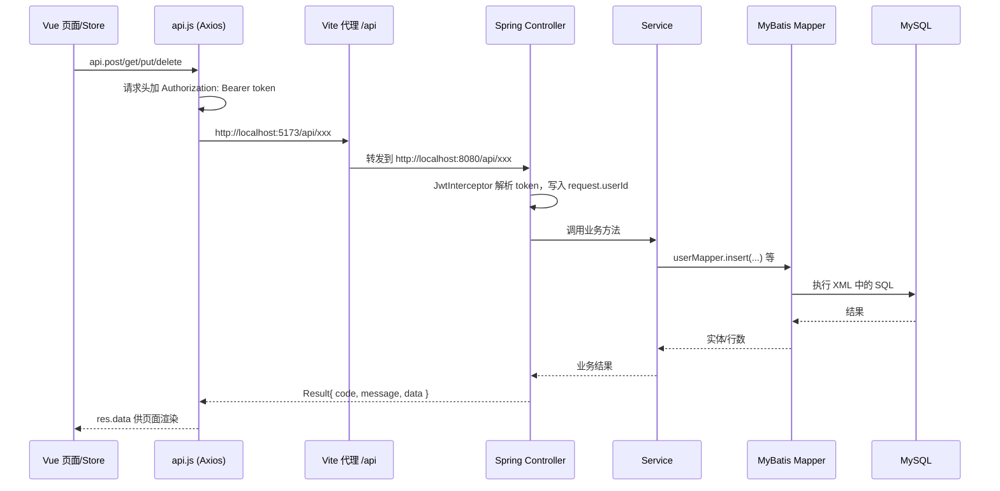

# 茶叶电商平台 — 答辩功能模块说明

> 本文档面向答辩场景，说明**当前项目实际在用的功能**、前后端如何对接、后端代码位置、以及数据如何写入 MySQL。建议配合 IDE 打开对应文件对照阅读。

---

## 一、项目概览

| 层级 | 技术 | 目录 |
|------|------|------|
| 前端 | Vue 3 + Vue Router + Pinia + Element Plus + Axios | `frontend/` |
| 后端 | Spring Boot + MyBatis | `src/main/java/com/reservation/teaecommerceplatform/` |
| 数据库 | MySQL 8，库名 `tea_ecommerce` | `src/main/resources/db/tea_ecommerce.sql` |
| 运行端口 | 前端 5173，后端 8080 | `frontend/vite.config.js`、`application.properties` |

**角色约定（贯穿全项目）：**

- `role = 0`：普通买家  
- `role = 1`：平台管理员（可进 `/admin`）  
- `role = 2`：商家（可进 `/merchant`，管理自己的商品与订单）

---

## 二、整体架构：前端如何把数据传给后端



### 2.1 前端入口（必记 3 个文件）

1. **`frontend/src/utils/api.js`**  
   - 创建 Axios 实例，`baseURL: '/api'`  
   - 每次请求自动带上 `Authorization: Bearer ${token}`（token 存在 Pinia + localStorage）  
   - 统一处理响应：`code === 200` 成功；`401` 清 token 并跳转登录  

2. **`frontend/vite.config.js`**  
   - 开发时把 `/api` 代理到 `http://localhost:8080`，所以前端写 `/api/user/login` 实际打到后端 Spring Boot。

3. **`frontend/src/stores/user.js`**  
   - 登录后保存 token，并调用 `/user/info` 拉用户信息（含 `role`）。

### 2.2 后端统一响应格式

**`src/main/java/.../common/Result.java`**

```json
{
  "code": 200,
  "message": "操作成功",
  "data": { ... }
}
```

业务失败时 `code` 多为 `500`，未登录时部分接口返回 `401`。

### 2.3 登录鉴权流程

1. 用户登录 → `POST /api/user/login`，body：`{ username, password }`  
2. 后端 `UserServiceImpl.login` 校验 MD5 密码，用 `JwtUtil` 生成 JWT  
3. 前端把 `data.token` 存入 localStorage  
4. 之后每个请求：`JwtInterceptor` 从 `Authorization` 头解析 token，把 **`userId` 放进 `HttpServletRequest`**  
5. Controller 里通过 `(Long) request.getAttribute("userId")` 获取当前用户  

**匿名可访问的接口**（在 `WebConfig` 中排除 JWT 校验路径，但仍会尝试解析 token）：  
注册、登录、商品列表、商品详情、分类列表。

**管理员专属**：`/api/admin/**`、分类增删改、`/api/upload/**` 由 `AdminInterceptor` 校验 `role === 1`。

---

## 三、后端分层与“数据库代码在哪”

答辩时可以说：**Controller 接 HTTP → Service 写业务 → Mapper 接口 + XML 写 SQL → MySQL**。

| 层次 | 作用 | 位置示例 |
|------|------|----------|
| Controller | 定义 REST 路径、接收 JSON、取 userId | `controller/UserController.java` |
| Service | 业务规则、事务、多表协作 | `service/impl/OrderServiceImpl.java` |
| Mapper 接口 | Java 方法声明 | `mapper/UserMapper.java` |
| Mapper XML | **真正插入/更新/查询数据库的 SQL** | `src/main/resources/mapper/UserMapper.xml` |
| Entity | 与表字段对应的 Java 对象 | `entity/User.java` |

**插入数据库的典型写法（以注册为例）：**

```java
// UserServiceImpl.java
userMapper.insert(user);
```

```xml
<!-- UserMapper.xml -->
<insert id="insert" useGeneratedKeys="true" keyProperty="id">
    INSERT INTO user (username, password, ...) VALUES (#{username}, #{password}, ...)
</insert>
```

`useGeneratedKeys="true"` 表示插入后把数据库自增主键回填到 `user.id`。

**MyBatis 配置**（`application.properties`）：

- `mybatis.mapper-locations=classpath:mapper/*.xml`  
- `map-underscore-to-camel-case=true`（表字段 `create_time` → Java `createTime`）

---

## 四、数据库表一览（10 张）

脚本：`src/main/resources/db/tea_ecommerce.sql`

| 表名 | 用途 |
|------|------|
| `user` | 用户账号、角色、商家入驻申请字段 |
| `category` | 商品分类（绿茶、红茶等） |
| `product` | 商品（含 seller_id 商家、库存、销量） |
| `cart` | 购物车 |
| `address` | 收货地址 |
| `order` | 订单主表 |
| `order_item` | 订单明细（含 seller_id） |
| `refund` | 退款/退货申请 |
| `review` | 商品评价 |
| `logistics` | 物流轨迹（库表保留示例数据，业务未接入；订单/退款仅用 `logistics_no` 字段） |

---

## 五、功能模块详解（按答辩顺序）

### 模块 1：用户注册与登录

| 项目 | 说明 |
|------|------|
| 前端页面 | `views/Login.vue`、`views/Register.vue` |
| 前端调用 | `stores/user.js` → `POST /user/login`、`POST /user/register` |
| 后端 Controller | `UserController.java` |
| 后端 Service | `UserServiceImpl.java` |
| 数据库 | `user` 表，`UserMapper.xml` 的 `insert` / `selectByUsername` |
| 核心逻辑 | 密码 `Md5Util.encrypt`；注册默认 `role=0`、`status=1`；登录成功返回 JWT |

**答辩话术示例：**  
“前端把用户名密码 JSON 发到 `/api/user/login`，Controller 交给 Service 查库比对 MD5，通过后 JwtUtil 生成 token 返回，前端存 localStorage，之后 Axios 拦截器自动带 Bearer token。”

---

### 模块 2：个人中心

| 项目 | 说明 |
|------|------|
| 前端页面 | `views/Profile.vue` |
| API | `GET/PUT /user/info`、`PUT /user/password` |
| 后端 | `UserController` + `UserServiceImpl` |
| 数据库 | `user` 表 `update`、`updatePassword` |

路由守卫：`meta.requiresAuth: true` 未登录跳转 `/login`。

---

### 模块 3：首页与商品浏览（无需登录）

| 项目 | 说明 |
|------|------|
| 前端页面 | `views/Home.vue`、`views/Products.vue`、`views/ProductDetail.vue` |
| API | `GET /category/list`、`GET /product/list`、`GET /product/detail/{id}` |
| 后端 | `CategoryController`、`ProductController` + 对应 Service |
| 数据库 | `category`、`product` |

商品列表支持：分类筛选、关键词、价格区间、排序（销量/价格）、分页（`ProductQueryDTO`）。

商品详情页还会请求：`GET /review/product/{productId}` 展示评价。

**茶文化页 `TeaCulture.vue`**：纯前端静态内容 + 锚点导航，**不请求后端**；商品详情里茶文化关键词可跳转到该页对应章节。

---

### 模块 4：购物车

| 项目 | 说明 |
|------|------|
| 前端页面 | `views/Cart.vue`；加购在 `stores/cart.js`、`ProductDetail.vue` |
| API | `GET /cart/list`、`POST /cart/add`、`PUT /cart/update`、`DELETE /cart/remove/{id}` |
| 后端 | `CartController` → `CartServiceImpl` |
| 数据库 | `cart` 表；`uk_user_product` 保证同一用户同一商品一条记录，重复加购则 `updateQuantity` |

加购前会查 `product` 校验库存与上架状态。

---

### 模块 5：收货地址

| 项目 | 说明 |
|------|------|
| 前端页面 | `views/Addresses.vue` |
| API | `GET /address/list`、`POST /address/add`、`PUT /address/update`、`POST /address/setDefault`、`DELETE /address/delete/{id}` |
| 后端 | `AddressController` → `AddressServiceImpl` |
| 数据库 | `address` |

设置默认地址时，Service 会先把该用户其它地址 `is_default=0`，再更新目标地址为 1。

---

### 模块 6：下单与订单（核心业务）

| 项目 | 说明 |
|------|------|
| 前端 | `Addresses.vue` 结算对话框 → `POST /order/create`；`Orders.vue`、`OrderDetail.vue` |
| API | 创建、列表、详情、支付、取消、确认收货 |
| 后端 | `OrderController` → **`OrderServiceImpl`（建议答辩重点读这个文件）** |
| 数据库 | `order`、`order_item`、`cart`、`product`、`address` |

**创建订单流程（`OrderServiceImpl.createOrder`，带 `@Transactional`）：**

1. 校验 `address` 属于当前用户  
2. 从 `cart` 取商品（可传 `cartIds` 只结算选中项）  
3. 遍历购物车：检查商品上架、库存，累加 `totalAmount`  
4. `orderMapper.insert(order)` — 状态 **0 待支付**  
5. 每个购物车项：`orderItemMapper.insert` + **`productMapper.updateStock` 扣库存**  
6. `cartMapper.deleteByUserId` 清空购物车  

**订单状态（`order.status`）：**

| 值 | 含义 | 典型操作 |
|----|------|----------|
| 0 | 待支付 | 创建订单；可取消（恢复库存） |
| 1 | 已支付 | `POST /order/pay` 模拟支付 |
| 2 | 已发货 | 管理端/商家端改状态 |
| 3 | 已完成 | 用户确认收货，**累加商品销量** |
| 4 | 已取消 | 仅待支付可取消 |
| 5/6 | 退款中/已退款 | 与退款模块联动 |

**支付**：`payOrder` 把状态改为 1，记录 `payType`、`payTime`（模拟，未接真实支付网关）。

**前端传参示例（结算）：**

```javascript
await api.post('/order/create', {
  addressId: selectedAddress.id,
  remark: '...',
  cartIds: [1, 2, 3]  // 选中的购物车项 id
})
```

---

### 模块 7：退款

| 项目 | 说明 |
|------|------|
| 前端 | `OrderDetail.vue` 申请退款、填退货快递单号 |
| 买家 API | `POST /refund/create`、`GET /refund/my`、`GET /refund/detail/{id}`、`POST /refund/update-logistics/{id}` |
| 管理端 | `AdminController` 下 `/admin/refunds/*` |
| 商家端 | `MerchantController` 下 `/merchant/refunds/*` |
| 后端 Service | `RefundServiceImpl` |
| 数据库 | `refund` |

管理端/商家端共用 `RefundManagement.vue`，根据路由判断 `getBasePath()` 是 `/admin/refunds` 还是 `/merchant/refunds`。

---

### 模块 8：评价

| 项目 | 说明 |
|------|------|
| 前端 | `OrderDetail.vue` 提交评价；`ProductDetail.vue` 展示评价列表 |
| API | `POST /review/create`、`GET /review/product/{id}`、`GET /review/order/{orderId}` |
| 后端 | `ReviewController` → `ReviewServiceImpl` |
| 数据库 | `review` |

后台另有评论管理 API（`AdminController` `/admin/reviews`），**当前前端路由未单独做评论管理页面**，接口已实现可供扩展。

---

### 模块 9：商家入驻

| 项目 | 说明 |
|------|------|
| 前端 | `views/JoinUs.vue` → `POST /user/merchant/apply` |
| 管理端 | `MerchantApplicationManagement.vue` |
| 数据存储 | **入驻信息存在 `user` 表**，不是单独申请表；字段如 `merchant_name`、`merchant_apply_status` |
| 审核 | `POST /admin/merchant-applications/{id}/approve` → 用户 `role` 变为 2 |

申请状态：`1` 待审核，`2` 通过，`3` 驳回。

---

### 模块 10：管理后台（管理员 role=1）

路由前缀：`/admin/*`，布局 `layouts/AdminLayout.vue`。

| 菜单 | 前端文件 | 主要 API |
|------|----------|----------|
| 数据统计 | `admin/Dashboard.vue` | `GET /admin/statistics/dashboard` |
| 订单管理 | `admin/OrderManagement.vue` | `GET /admin/orders`、`PUT /admin/orders/{id}/status` |
| 退款管理 | `admin/RefundManagement.vue` | `/admin/refunds/*` |
| 商品管理 | `admin/ProductManagement.vue` | `GET/POST/PUT/DELETE /product/*`（全站） |
| 分类管理 | `admin/CategoryManagement.vue` | `/category/*` 写操作需管理员 |
| 用户管理 | `admin/UserManagement.vue` | `/admin/users` |
| 商家申请 | `admin/MerchantApplicationManagement.vue` | `/admin/merchant-applications` |

统计实现：`StatisticsServiceImpl` 聚合查询 `user`、`product`、`order` 等 Mapper。

---

### 模块 11：商家后台（商家 role=2）

路由前缀：`/merchant/*`，复用部分 admin 组件但 API 不同：

| 功能 | API 前缀 |
|------|----------|
| 我的商品 | `/merchant/products` |
| 店铺订单 | `/merchant/orders`（按 `order_item.seller_id` 过滤） |
| 店铺退款 | `/merchant/refunds` |

`MerchantController.checkMerchantRole` 要求 `role=2`；管理员访问会提示“请使用管理后台”。

商品增删改：`ProductService` 内校验商家只能操作 `sellerId` 为自己的商品。

---

### 模块 12：图片上传

| 项目 | 说明 |
|------|------|
| 前端 | `ProductManagement.vue`、`CategoryManagement.vue` 中 `el-upload`，`action="/api/upload/image"` |
| 后端 | `FileUploadController`：保存到本地 `uploads/`，返回 URL |
| 访问 | `WebConfig` 映射 `/uploads/**` → 磁盘目录 |

**注意：** 上传接口在 `AdminInterceptor` 保护下，**仅管理员 token 可上传**。商家后台若用同一上传组件，需确认答辩时是否用管理员账号演示，或说明此为当前实现限制。

---

### 模块 13：Redis

`application.properties` 配置了 Redis，`RedisConfig` 注册了 `RedisTemplate`，**当前业务 Service 中未使用 Redis 做缓存/会话**，答辩可说明“已预留扩展，核心数据仍走 MySQL”。

---

## 六、后端 Controller 与前端 API 对照表

| Controller | 路径前缀 | 职责 |
|------------|----------|------|
| `UserController` | `/api/user` | 注册、登录、资料、改密、商家申请 |
| `ProductController` | `/api/product` | 商品 CRUD、列表、详情 |
| `CategoryController` | `/api/category` | 分类 CRUD、列表 |
| `CartController` | `/api/cart` | 购物车 |
| `AddressController` | `/api/address` | 地址 |
| `OrderController` | `/api/order` | C 端订单 |
| `RefundController` | `/api/refund` | C 端退款 |
| `ReviewController` | `/api/review` | 评价 |
| `AdminController` | `/api/admin` | 管理端全集 |
| `MerchantController` | `/api/merchant` | 商家端 |
| `FileUploadController` | `/api/upload` | 图片 |

---

## 七、答辩高频问题速答

**Q1：前后端怎么联调？**  
开发环境 Vite 代理 `/api` → 8080；生产需 Nginx 同样转发。数据格式统一为 `Result` JSON。

**Q2：怎么知道当前是哪个用户？**  
JWT → 拦截器解析 → `request.setAttribute("userId")` → Controller/Service 使用。

**Q3：下单如何保证数据一致？**  
`@Transactional`：订单、订单项、扣库存、清购物车同一事务，任一步失败回滚。

**Q4：SQL 写在哪里？**  
不在 Java 字符串里拼 SQL，而在 `src/main/resources/mapper/*.xml`，由 MyBatis 执行。

**Q5：和真实电商差在哪？**  
支付为模拟；物流以改订单状态/单号为主；未用消息队列；Redis 未参与业务缓存。

**Q6：权限怎么控制？**  
三层：① Vue 路由 `beforeEach` 检查 token 和 role；② `AdminInterceptor` 保护管理 API；③ Service 层校验商家只能操作自己的 `sellerId`。

---

## 八、建议答辩演示路径（约 5–8 分钟）

1. 打开首页 → 商品列表 → 商品详情（说明匿名可看）  
2. 注册/登录 → 加购物车 → 地址管理 → 提交订单  
3. 订单列表支付 → 管理端把订单改为已发货 → 用户确认收货  
4. 可选：申请退款 → 商家/管理员审核  
5. 管理端 Dashboard 数据、商品/分类管理  
6. 商家入驻申请 → 管理员审核通过 → 商家登录维护商品  

---

## 九、关键文件速查（背路径用）

```
frontend/src/utils/api.js          # 所有 HTTP 出口
frontend/src/router/index.js       # 页面路由与权限
frontend/src/stores/user.js        # 登录态
frontend/src/stores/cart.js        # 购物车角标

src/main/java/.../controller/      # 接口定义
src/main/java/.../service/impl/    # 业务逻辑（重点）
src/main/resources/mapper/*.xml    # SQL（插入/更新在这里）
src/main/resources/db/tea_ecommerce.sql  # 表结构
src/main/java/.../config/WebConfig.java    # 拦截器与静态资源
src/main/java/.../interceptor/JwtInterceptor.java
```

---

*文档根据当前仓库代码整理，若后续增删接口请以实际代码为准。*
